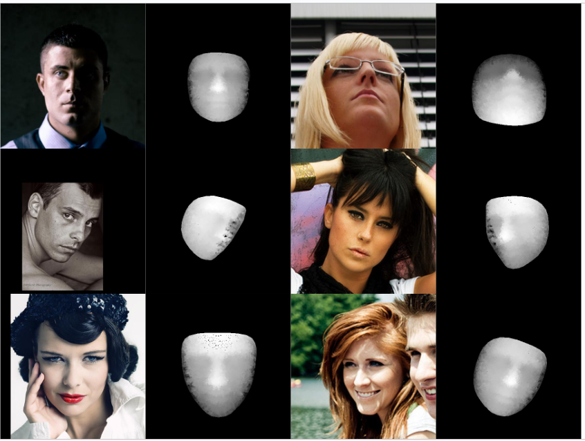

# Dense-face-base-on-3D-landmarks
#### Using medipipe face mesh to detect 468 3D facial landmarks and use it to reconstruct 3D face mesh
<div style="text-align:center;">
    
</div>
<div style="text-align:center;">
    
</div>


## 1. Usage
***1.1. Setup env***  
```
git clone https://github.com/nguyentrongvan/Dense-face-base-on-3D-landmarks.git
cd Dense-face-base-on-3D-landmarks 
pip install -r requirements.txt
```


***1.2. Run demo***  
```
python demo.py
```

## 2. Demo result
### Face dense generation:

<div style="text-align:center;">
    
    
</div>


### Face depth estimation:



### 3D face mesh reconstruction:
<div style="text-align:center;">
    
    
</div>

